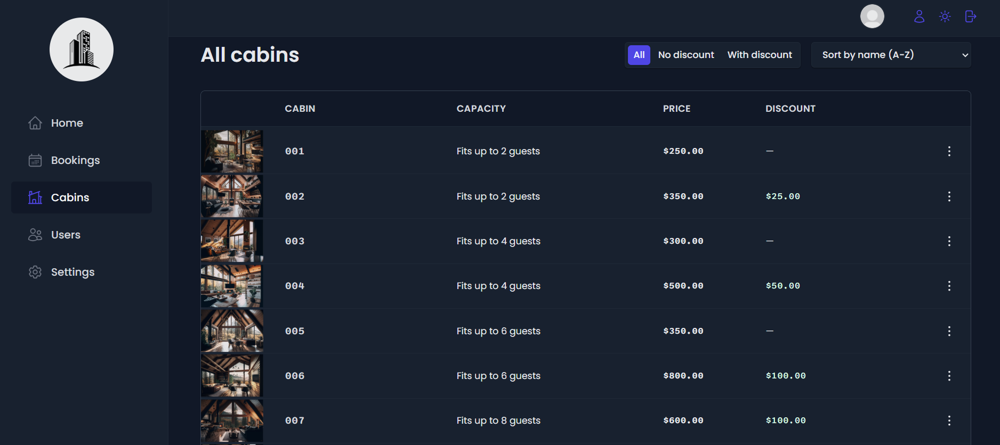
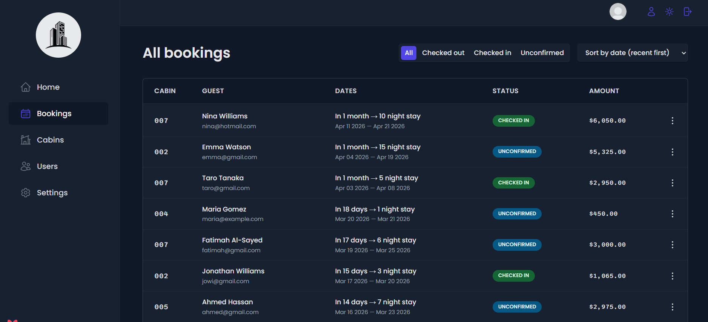
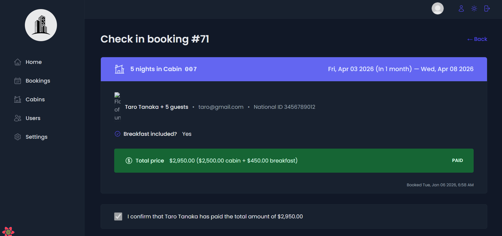

# BookingNest

BookingNest is a modern admin dashboard for managing cabin bookings. Built with React and Supabase, it provides full CRUD functionality for cabins, users, and bookings. The platform includes an analytics dashboard with revenue, occupancy metrics, charts, server-side pagination, filtering, search, image uploads, and dark mode — all designed to deliver a clean and responsive admin experience.

---

## 📸 Screenshots

Here are some snapshots of BookingNest in action:

- **Dashboard Overview:**  
  

- **Cabins Management:**  
  

- **Bookings Overview:**  
  

- **Check-in Details:**  
  

- **Booking Details:**  
  

## 🧭 Overview

- Admin dashboard only for managing cabins and bookings
- Email/password authentication with email verification
- Protected routes for secure access
- Context API + React Query for global state and server state management
- Advanced filtering, sorting, and search
- Image uploads for cabins
- Server-side pagination for bookings and cabins
- Dark mode support
- Full-stack React + Supabase architecture

---

## ✨ Key Features

### 🏠 Cabin & Booking Management

- Create, read, update, and delete cabins
- Manage bookings and check-ins
- Upload images for cabins
- Server-side pagination and sorting

### 📊 Analytics Dashboard

- Track total bookings, revenue, and occupancy rate
- Visual charts using Recharts (line & pie)
- Real-time dashboard updates

### 🔐 Authentication & Security

- Email/password authentication
- Email verification for new users
- Protected routes for admin-only access
- Role-based access if extended later

### 🎨 Modern UI

- Dark mode toggle
- Responsive design for mobile and desktop
- Loading spinners for smooth UX
- Compound components and reusable UI elements

### ⚙️ Backend Integration

- Supabase for database and authentication
- Handles CRUD operations securely
- Real-time data fetching and caching with React Query
- Context API for shared global state
---

## 🚀 How to Run

1. Clone the repository
2. Cd BookingNest
3. Open the terminal and type (npm install)
4. Run the porjct (npm run dev)

## 📈 Future Enhancements

- Public-facing booking portal for users
- Role-based access for different admin levels
- Booking calendar view

## 📄 License

This project is licensed under the MIT License.

## 👤 Author

📧 moneebcodebase@gmail.com
🌐 www.linkedin.com/in/moneeb-al-zakoot
💻 https://github.com/moneebcodebase

Feel free to reach out or contribute via GitHub.
